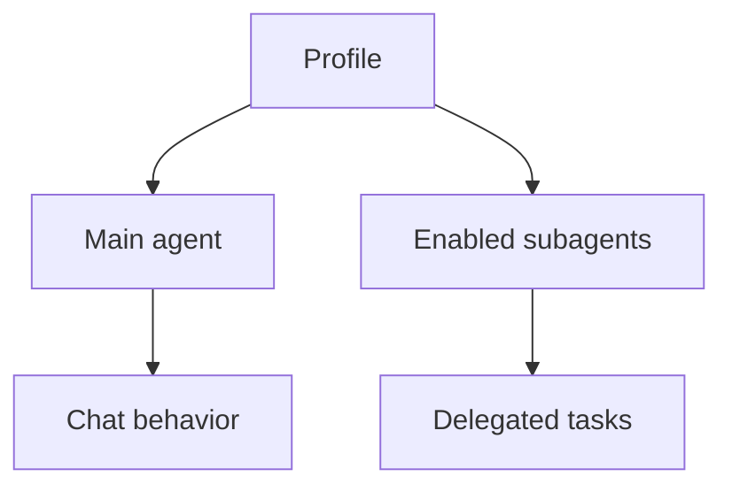

<div align="center">

<pre style="line-height: 1;">
  ____    _    _   _ ____  _______     _____ ____ _____  _    _   _      _    ___ 
 / ___|  / \  | \ | |  _ \| ____\ \   / /_ _/ ___|_   _|/ \  | \ | |    / \  |_ _|
 \___ \ / _ \ |  \| | | | |  _|  \ \ / / | |\___ \ | | / _ \ |  \| |   / _ \  | | 
  ___) / ___ \| |\  | |_| | |___  \ V /  | | ___) || |/ ___ \| |\  |_ / ___ \ | | 
 |____/_/   \_\_| \_|____/|_____|  \_/  |___|____/ |_/_/   \_\_| \_(_)_/   \_\___|
                                                                                  
</pre>

`AI Coding Harness` nowadays are whether its a TUI, or just VSCode fork with some 'built in' extra 1 or 2 extension bruh. ultraworker? more like ultraslow or ultraslop iguess?. Behold the ~3mb coding agent harness + IDE that looks shady and suspicious like a virus but it actually works and get the job done. not some ultraworker, super agent or any of that BS, just raw speed, lightweight, thats it.

Project name is referenced after cyberpunk 2077's sandevistan chrome that activate as you wanted it to be, and perform as you wanted it to be. But cyberpunk's sandy is slowing time, which theoritically not possible so instead, the workaround is to make it 'work really fast'.

</div>

## Install

| Platform | Command |
|---|---|
| Arch / Linux tar | <code>curl -fsSL https://raw.githubusercontent.com/CorneliusTantius/sandevistan-ai/main/docs/scripts/install-arch-native.sh &#124; sh</code> |
| Debian / Ubuntu | <code>curl -fsSL https://raw.githubusercontent.com/CorneliusTantius/sandevistan-ai/main/docs/scripts/install-debian-ubuntu.sh &#124; sh</code> |
| Fedora / RHEL | <code>curl -fsSL https://raw.githubusercontent.com/CorneliusTantius/sandevistan-ai/main/docs/scripts/install-fedora.sh &#124; sh</code> |
| Windows | Download installer from latest release. |
| macOS Intel / Apple Silicon | <code>curl -fsSL https://raw.githubusercontent.com/CorneliusTantius/sandevistan-ai/main/docs/scripts/install-macos.sh &#124; sh</code> |

<!-- macOS installer removes quarantine automatically. -->

## Setting up AI API

1. Open Sandevistan and click `mods`.
2. Go to `providers`, then edit `openai` or add a new provider.
3. Set the API base and API key:

   ```txt
   API base: https://api.openai.com/v1
   API key: your_api_key_here
   ```

4. Go to `models` and select/add a model, for example `gpt-4o-mini`.
5. Click `save mods`, then test it in chat.

OpenAI-compatible providers also work: use their API base URL and model ID.



## Tech Stack

- 🦀 Rust
- 🟠 Tauri
- 🧡 Svelte
- 🔷 TypeScript
- ⚡ Vite
- 🟢 Node.js

